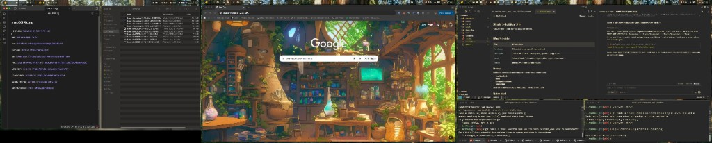

# Shishi's dotfiles - macOS ricing ✨🦌



## What's inside

| Tool                                                   | What it does                                                    |
| ------------------------------------------------------ | --------------------------------------------------------------- |
| [AeroSpace](https://github.com/nikitabobko/AeroSpace)  | Tiling window manager (i3-like keybinds)                        |
| [JankyBorders](https://github.com/FelixKratz/JankyBorders) | Colored borders on the focused window                       |
| [SketchyBar](https://github.com/FelixKratz/SketchyBar) | Custom menu bar with workspaces, system info, app icons         |
| [Cursor](https://cursor.sh)                            | Editor (VSCode fork) with settings, keybindings, and extensions |
| [iTerm2](https://iterm2.com)                           | Terminal with color scheme presets                              |
| [Raycast](https://raycast.com)                         | Spotlight replacement with extensions and custom commands        |
| [Spicetify](https://spicetify.app)                     | Spotify client customization (themes, extensions, marketplace)  |

### Themes

Switch the entire stack between color themes with one command:

- **Gruvbox Dark**
- **Nord**
- **Catppuccin Mocha**
- **Tokyo Night**

Each theme applies to JankyBorders, SketchyBar, Cursor, iTerm2, and Chrome.

## Quick start

```bash
git clone https://github.com/<you>/dotfiles.git ~/dotfiles
cd ~/dotfiles
./setup.sh
```

`setup.sh` handles everything:

1. Installs [Homebrew](https://brew.sh) if missing
2. Installs all packages, casks, and fonts via `Brewfile`
3. Starts JankyBorders and SketchyBar
4. Symlinks configs into `~/.config` and Cursor's config directory
5. Installs Cursor extensions from `cursor/extensions.txt`
6. Imports iTerm2 color presets
7. Installs Spicetify with Marketplace (pick a theme inside Spotify)

> **Note:** Sign into Raycast to sync your settings.

## Scripts

| Script                            | Usage                                                                   |
| --------------------------------- | ----------------------------------------------------------------------- |
| `scripts/switch-theme.sh <theme>` | Switch color theme across all tools                                     |
| `scripts/sync-cursor.sh`          | Export currently installed Cursor extensions to `cursor/extensions.txt` |
| `scripts/reload.sh`               | Reload AeroSpace, SketchyBar, and JankyBorders                         |
| `scripts/link.sh`                 | Re-link config symlinks (called by `setup.sh`)                          |

Run `scripts/switch-theme.sh` with no arguments to list available themes.

## Development

### Docs

- [AeroSpace guide](https://nikitabobko.github.io/AeroSpace/guide)
- [JankyBorders docs](https://github.com/FelixKratz/JankyBorders#configuration)
- [SketchyBar config reference](https://felixkratz.github.io/SketchyBar/config/bar)
- [Cursor docs](https://docs.cursor.sh)
- [iTerm2 docs](https://iterm2.com/documentation.html)
- [Raycast manual](https://manual.raycast.com)
- [Spicetify docs](https://spicetify.app/docs/getting-started)

### Must-know commands

**Reload configs:**

| What                   | How                                           |
| ---------------------- | --------------------------------------------- |
| Reload everything      | `scripts/reload.sh` or `alt-shift-;` then `a` |
| Reload AeroSpace only  | `alt-shift-;` then `esc`                      |
| Reload SketchyBar only | `sketchybar --reload`                         |

**AeroSpace keybindings (main mode):**

| Keys                           | Action                         |
| ------------------------------ | ------------------------------ |
| `ctrl-alt-arrows`              | Focus window                   |
| `ctrl-alt-shift-arrows`        | Move window                    |
| `alt-1` .. `alt-9`             | Switch workspace               |
| `alt-shift-1` .. `alt-shift-9` | Move window to workspace       |
| `alt-f`                        | Fullscreen                     |
| `alt-/`                        | Tiles layout                   |
| `alt-,`                        | Accordion layout               |
| `alt-tab`                      | Back-and-forth workspace       |
| `alt-shift-tab`                | Move workspace to next monitor |
| `alt-0`                        | Switch to temp workspace       |
| `alt-shift-0`                  | Move window to temp workspace  |
| `alt-shift-d`                  | Dev layout                     |
| `alt-shift-r`                  | Enter resize mode              |
| `alt-shift-;`                  | Enter service mode             |

**Resize mode** (`alt-shift-r`): `h`/`j`/`k`/`l` to resize, `b` to balance, `esc` to exit.

**Service mode** (`alt-shift-;`): `esc` reload config, `r` flatten tree, `f` toggle float, `backspace` close other windows.

## Repo structure

```
dotfiles/
├── setup.sh                  # Full setup entry point
├── Brewfile                  # Homebrew dependencies
├── scripts/
│   ├── link.sh               # Symlink configs
│   ├── switch-theme.sh       # Theme switcher
│   └── sync-cursor.sh        # Export Cursor extensions
├── aerospace/
│   ├── aerospace.toml         # Window manager config
│   └── scripts/               # Aerospace helper scripts
├── borders/
│   ├── bordersrc              # JankyBorders config
│   └── colors.sh              # Active border colors (auto-generated)
├── sketchybar/
│   ├── sketchybarrc           # Bar config
│   ├── colors.sh              # Active theme colors (auto-generated)
│   └── plugins/               # Bar item scripts
├── cursor/
│   ├── settings.json          # Editor settings
│   ├── keybindings.json       # Keybindings
│   └── extensions.txt         # Extension list
└── themes/
    ├── gruvbox/
    ├── nord/
    ├── catppuccin-mocha/
    └── tokyo-night/
```
